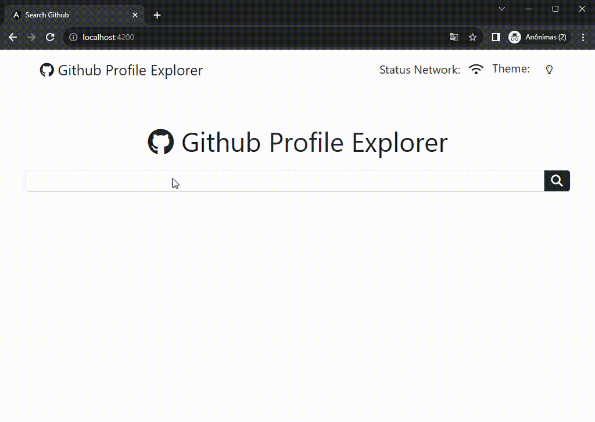
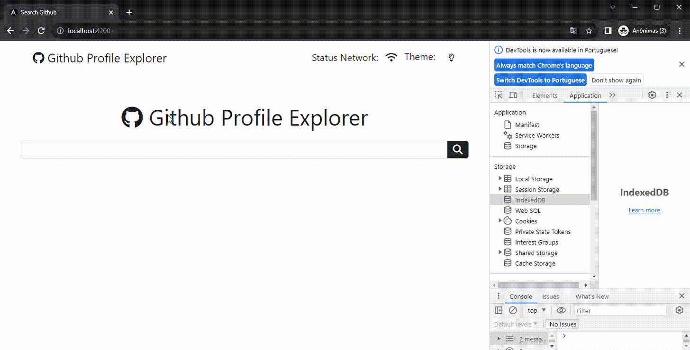
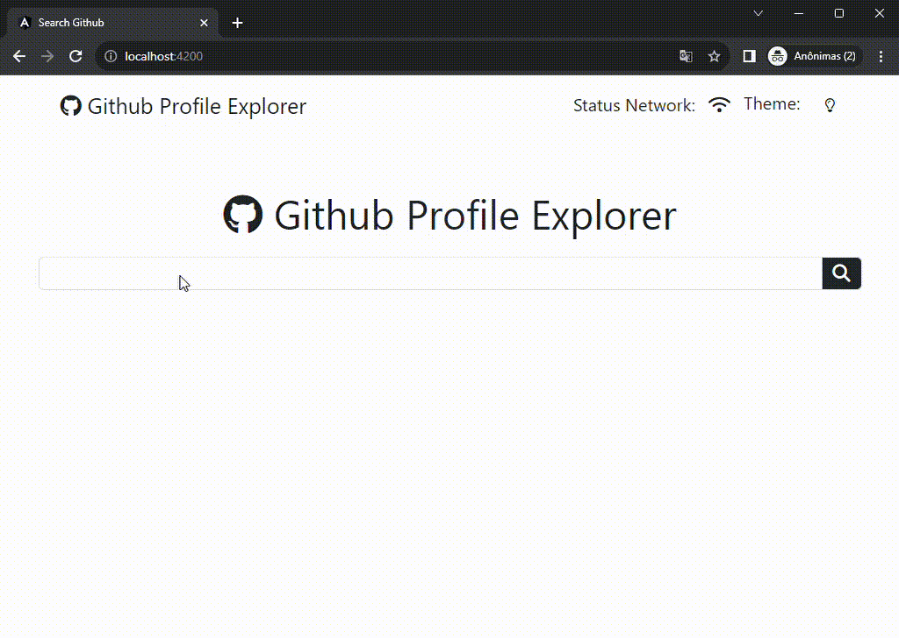
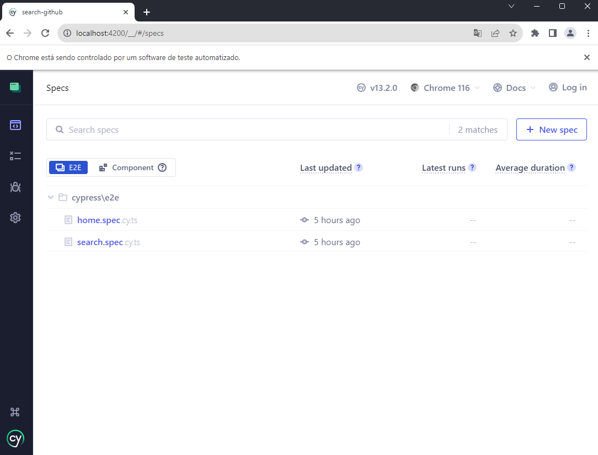
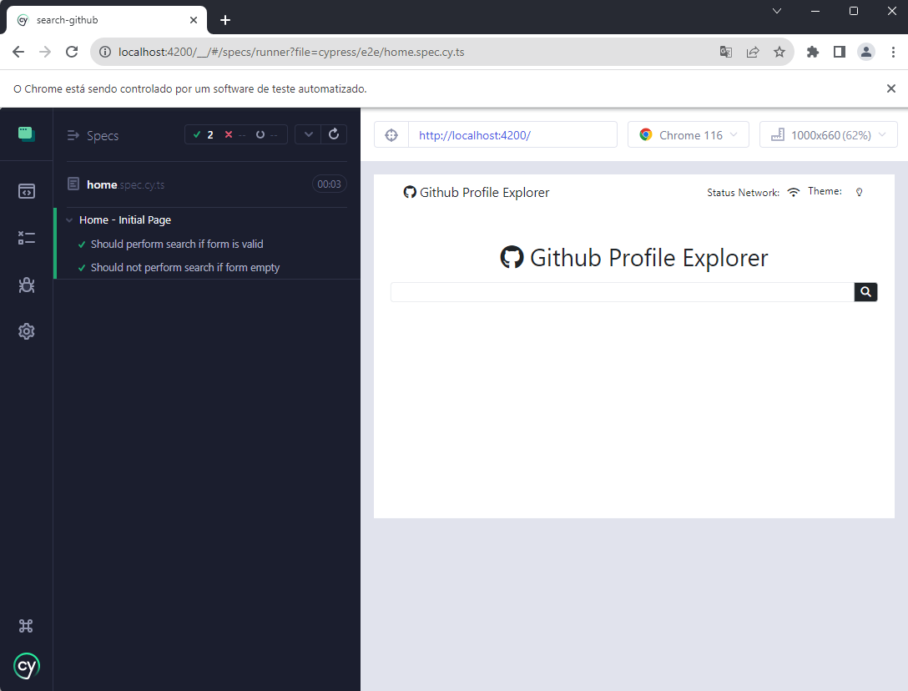

# Search Github

This project is designed for user searches with the Github API

## Index
* [Summary](#summary)
* [Technologies](#technologies)
* [Installation](#installation)
* [Running Application](#running-application)
* [Unit Tests](#running-unit-tests)
* [End-to-End Tests](#running-end-to-end-tests)

## Summary
This project is designed for user searches with the Github API based on [official documentation](https://docs.github.com/pt/rest/).
In addition to searching and listing, users retrieve information regarding: Followers, Following, Public Repositories, Location and Stars.
Added option for offline querying if the internet connection drops, so the information returned from the API is saved in the browser in IndexedDB.
Additional light and dark theme mode options.

### Demo


### Offline


### Theme


## Technologies
* [Angular](https://angular.io/) version: 16.2.1
* [Bootstrap](https://getbootstrap.com/) version: 5.2.3
* [fontawesome-free](https://fontawesome.com/) version 6.0.0
* [ngx-toastr](https://www.npmjs.com/package/ngx-toastr) version 17.0.2 for user notifications
* [Dexie](https://dexie.org/) version: 3.2.4 for save the data in the browser in IndexedDB
* [Jasmine](https://jasmine.github.io/) version: 4.6.0 for unit test
* [Cypress](https://docs.cypress.io/) version: 13.2.0 for testes End-to-End


## Installation
### Platform & tools

You need to install Node.js and then the development tools. Node.js comes with a package manager called [npm](http://npmjs.org) for installing NodeJS applications and libraries.
* [Install node.js](https://nodejs.org/) 

### Get the Code

Either clone this repository or fork it on GitHub and clone your fork:

```
git clone https://github.com/stefano2007/search-profile-github.git
cd search-profile-github
```

Install local dependencies (from the project root folder):
```
npm install
```
(This will install the dependencies declared in the ./package.json file)

## Running Application
* Generate a personal key for [API Github](https://docs.github.com/pt/authentication/keeping-your-account-and-data-secure/managing-your-personal-access-tokens) and change the parameter "github_Token" in \src\environment\environment.ts

Warning!!! When we upload the api token to github it is automatically recognized by github and invalidated, knowing this we convert the key twice using, for example, the "btoa" function 
```
  window.btoa(window.btoa('{GITHUB_TOKEN}'))
```

Run `ng serve` for a dev server. Navigate to `http://localhost:4200/`. The application will automatically reload if you change any of the source files.

## Running unit tests

Run `ng test` to execute the unit tests via [Karma](https://karma-runner.github.io).

## Running end-to-end tests 

Run `npm run cypress:open` to execute the end-to-end tests via cypress. 




